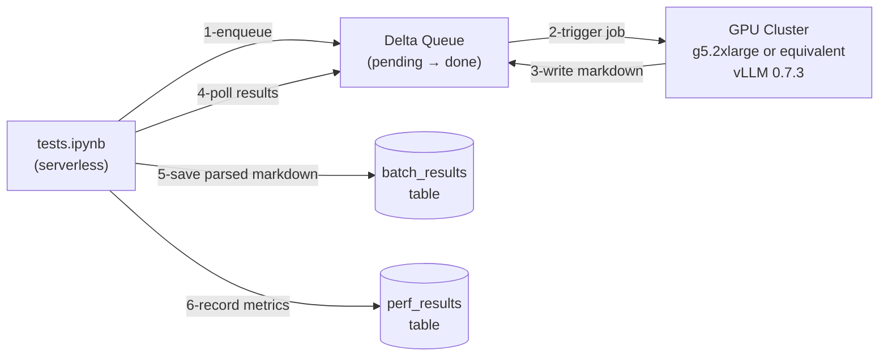
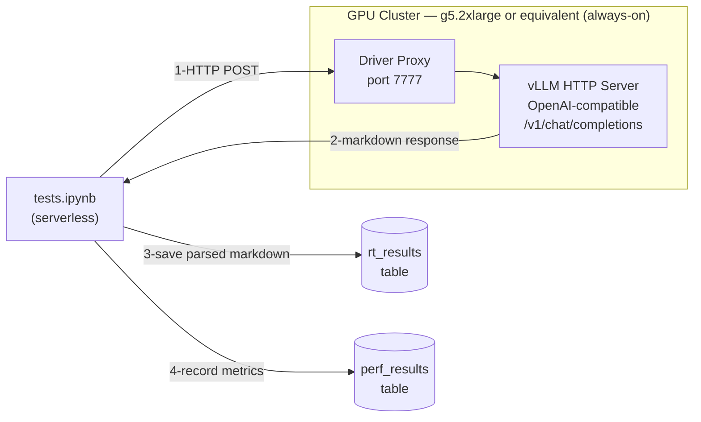

# Document Parsing with MinerU2.5 on Databricks — vLLM on Jobs Clusters

This tutorial walks you through serving [`opendatalab/MinerU2.5-2509-1.2B`](https://huggingface.co/opendatalab/MinerU2.5-2509-1.2B) — a vision-language model for document parsing — on Databricks using vLLM. You'll learn two deployment patterns that run on Jobs clusters:

| Pattern | How It Works | Best For |
|---------|-------------|----------|
| **vLLM_Batch** | Triggered batch job — cluster spins up on demand, processes a Delta queue, then shuts down | Scheduled / recurring workloads (pay-per-use) |
| **vLLM_RT** | Continuous job with a vLLM HTTP server exposed via the driver proxy | Interactive use, demos, prototyping (always-hot) |

---

## Architecture

### vLLM_Batch (Triggered Batch Job)



1. `tests.ipynb` base64-encodes each PDF and inserts a row into the Delta queue table (`status=pending`).
2. A triggered job spins up a GPU cluster, loads vLLM, and processes all pending rows.
3. Each row is updated with the extracted markdown (`status=done`).
4. `tests.ipynb` polls the queue, saves parsed markdown to the results table, and records latency in the perf table.

### vLLM_RT (Continuous Job + Driver Proxy)



1. A continuous job keeps a GPU cluster running with vLLM serving on port 7777.
2. `tests.ipynb` sends each PDF as a base64-encoded image via HTTP POST to the driver proxy.
3. vLLM returns extracted markdown in the response body.
4. Parsed markdown is saved to the results table. Latency is recorded in the perf table. No cold start since the model is always loaded.

---

## Project Structure

```
doc_parsing_mineru_vllm_databricks/
├── config.yaml                     # Central configuration (all notebooks read from this)
├── README.md                       # This file
├── RESULTS.md                      # Expected results and recommendations
│
├── setup/
│   ├── 00_download_model.ipynb     # Downloads MinerU2.5 (~3 GB) to Unity Catalog Volume
│   └── 01_prepare_test_cases.ipynb # Generates 4 synthetic test PDFs (TC1-TC4)
│
├── vllm_batch/
│   ├── notebook.ipynb              # GPU job: processes Delta queue rows with vLLM
│   └── tests.ipynb                 # Enqueues PDFs, triggers job, polls results, records metrics
│
├── vllm_real_time/
│   ├── notebook.ipynb              # Continuous job: runs vLLM HTTP server on driver proxy
│   └── tests.ipynb                 # Sends PDFs via HTTP to driver proxy, records metrics
│
└── comparison/
    └── notebook.ipynb              # Reads perf table, computes throughput, renders charts
```

---

## Prerequisites

| Requirement | Details |
|-------------|---------|
| **Databricks workspace** | With Unity Catalog enabled |
| **AWS GPU availability** | g5.2xlarge or equivalent (1x NVIDIA A10G, 24 GB VRAM) |
| **Databricks CLI** | Installed and configured with a profile (`databricks configure`) |

---

## Configuration

### config.yaml

All notebooks read from this single file. No hardcoded values anywhere.

| Field | Default | Description |
|-------|---------|-------------|
| `catalog` | `<your_catalog>` | Unity Catalog name |
| `schema` | `<your_schema>` | Schema within the catalog |
| `volume` | `data` | UC Volume name (auto-created by setup notebooks) |
| `model_subpath` | `models` | Subdirectory within the volume for the model |
| `hf_model_id` | `opendatalab/MinerU2.5-2509-1.2B` | HuggingFace model ID |
| `test_cases_subpath` | `test_cases` | Subdirectory for generated test PDFs |
| `queue_table` | `mineru_queue` | Delta table used as the batch job queue |
| `perf_table` | `mineru_perf_results` | Delta table for benchmark results |
| `batch_results_table` | `mineru_batch_results` | Delta table for parsed markdown from vLLM_Batch |
| `rt_results_table` | `mineru_rt_results` | Delta table for parsed markdown from vLLM_RT |
| `vllm_port` | `7777` | Port for the vLLM HTTP server (RT mode) |
| `vllm_model_name` | `mineru2.5` | Model name exposed via the OpenAI-compatible API |

---

## Tutorial

### Step 1 — Clone to your Databricks workspace

Clone this repo into your Databricks workspace using Git Folders (Repos).

### Step 2 — Configure

Edit `config.yaml` — set `catalog` and `schema` to your Unity Catalog values.

### Step 3 — Run setup notebooks (one-time)

| Order | Notebook | Compute | What it does |
|-------|----------|---------|--------------|
| 1 | `setup/00_download_model` | Serverless / CPU | Downloads MinerU2.5 (~3 GB) to UC Volume |
| 2 | `setup/01_prepare_test_cases` | Serverless / CPU | Generates TC1-TC4 test PDFs |

### Step 4 — Option A: Serve with vLLM_Batch

1. Create a **triggered job** pointing to `vllm_batch/notebook` on a GPU cluster.
2. Run `vllm_batch/tests` (serverless) — pass the `job_id` as a widget parameter.
3. The test notebook enqueues PDFs, triggers the job, polls for results, and writes metrics.

The cluster spins up only when triggered and shuts down after processing — you pay only for what you use.

### Step 5 — Option B: Serve with vLLM_RT

1. Create a **continuous job** pointing to `vllm_real_time/notebook` on a GPU cluster.
2. Wait for the cluster to start and vLLM to become ready.
3. Run `vllm_real_time/tests` (serverless) — pass the `cluster_id` as a widget parameter.
4. The test notebook sends PDFs to the driver proxy and writes metrics.
5. **Pause the job when done** to stop GPU billing.

The model stays loaded in memory, giving you sub-second per-page latency with no cold start.

### Step 6 — Compare results

Run `comparison/notebook` (serverless) to generate latency and throughput charts across both patterns.

---

## Cluster Requirements

| Notebook | GPU? | Instance | Runtime | Notes |
|----------|------|----------|---------|-------|
| `setup/00_download_model` | No | Serverless | CPU | Downloads ~3 GB model |
| `setup/01_prepare_test_cases` | No | Serverless | CPU | Generates PDF test fixtures |
| `vllm_batch/notebook` | **Yes** | g5.2xlarge or equivalent | **15.4 ML GPU** | Runs vLLM batch inference |
| `vllm_batch/tests` | No | Serverless | CPU | Enqueues PDFs + polls Delta queue |
| `vllm_real_time/notebook` | **Yes** | g5.2xlarge or equivalent | **15.4 ML GPU** | Continuous job; launches vLLM HTTP server |
| `vllm_real_time/tests` | No | Serverless | CPU | HTTP requests to vLLM driver proxy |
| `comparison/notebook` | No | Serverless | CPU | Reads perf table, renders charts |

**GPU cluster spec** (all GPU notebooks):
- **Instance**: g5.2xlarge or equivalent (AWS) — 1x NVIDIA A10G, 24 GB VRAM, 32 GB RAM
- **Runtime**: `15.4.x-gpu-ml-scala2.12` (Databricks ML GPU, Python 3.11)
- **Workers**: 0 (single-node; `spark.master = local[*, 4]`)
- **Cluster libraries**: None — all packages installed via `%pip install` inside notebooks

---

## Expected Results

On a g5.2xlarge or equivalent (1x NVIDIA A10G, 24 GB VRAM), you can expect:

| Metric | vLLM_Batch | vLLM_RT |
|--------|------------|---------|
| Cold start | ~845s (cluster + model load) | None (always running) |
| Per-page latency (warm) | ~1s | ~1s |
| Throughput (warm) | ~60 pages/min | ~60 pages/min |
| Idle cost | $0 (pay-per-use) | High (always-on GPU) |

See [RESULTS.md](RESULTS.md) for detailed per-test-case numbers.

---

## Known Limitations

### vLLM + MinerU2.5 Compatibility

- **vLLM pinned to 0.7.3** — v0.8.x has package conflicts with MLR 15.4's Python environment.
- **`rope_scaling` monkey-patch required** — MinerU2.5's `config.json` has conflicting `rope_type` and `type` fields that vLLM 0.7.3 rejects. Both GPU notebooks include a runtime patch.
- **transformers version**: must be `>=4.45, <5` (v5 removes `all_special_tokens_extended`).

### vLLM_Batch

- **Cold start dominates latency** (~845s for cluster + model load). Actual inference is ~1s per document.
- Queue polling granularity is ~15 seconds.

### vLLM_RT

- **GPU runs 24/7** even when idle. Pause the continuous job when not in use.
- **CUDA JIT compilation** on first inference takes 120+ seconds. Mitigated by a warmup request in the test notebook.
- **Driver proxy URL changes** if the cluster restarts. `cluster_id` must be passed manually to the test notebook.
- Driver proxy returns HTTP 401 when the cluster is terminated (not an auth error).

### General

- **Single-GPU only** — not scalable beyond one A10G without distributed vLLM (not implemented).
- **UC Volumes are read-only** — the RT notebook uses a symlink farm + local patched `config.json` as a workaround.
- **4 synthetic test cases only** — no real-world PDF diversity. Markdown output is sanity-checked (>5 chars) but not quality-evaluated.
- **PDF rasterization** is hardcoded to 150 DPI. Max 1 image per vLLM request (`--limit-mm-per-prompt image=1`) to fit in 24 GB VRAM.
